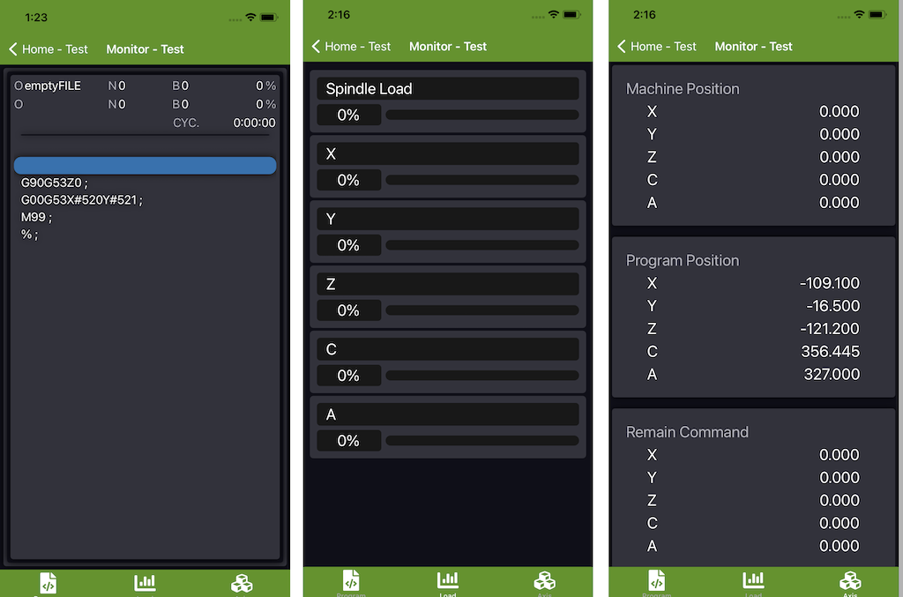

# HPMobile
---
**Mobile App of HartrolPremium**
* Version:4.0

## Display
---
* Program
* Tool Data
* Load
* Axis
* Utilization&DailyStatus(Version2.0)
* VirtualPanel(Version4.0)
* CCD(Version4.0)
## Operator
* Tool Offset
* QRcode search program
* Keyboard
* Calibration(Version2.0)
* Program Image(Version3.1)
* ## offline function
* Machining Calculate(Version4.0)
---

HartrolPremium Monitor

Mobile Display

## Contact Us
---
If you have any questions, You can contact us:

By email: hartrolpremium@gmail.com
